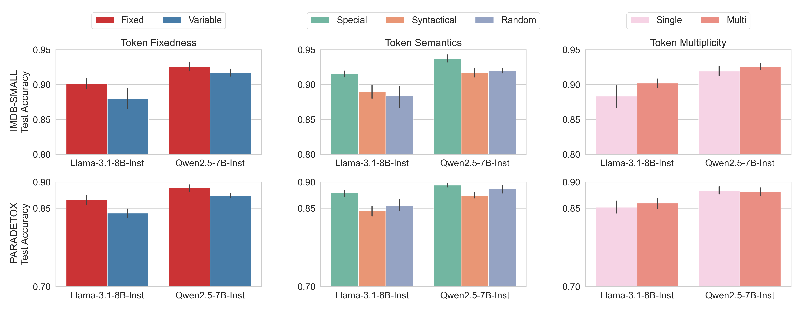

# Where Should I Probe? Optimal Token for LLM Probing

**Our findings suggest that combining a _Fixed Location_, _Special Token_ (e.g., Chat Template `<|eos|>`), and _Multiple Tokens_ yields the most effective probing setup for LLM hidden representations.**



This is because **a fixed representation serves as a stable anchor**, allowing the probe to consistently capture meaningful latent structures within the model’s hidden space.


### 🔹 Models
- `meta-llama/Meta-Llama-3.1-8B-Instruct`
- `Qwen/Qwen2.5-7B-Instruct`

### 🔹 Datasets
- `imdb-small`
- `paradetox`

To reproduce the results, 

```bash 
bash step1_activation.sh
bash step2_value_prober.sh
```


## Details of The Experiments

It is expected that query determines the representation. In this experiment, we explore how the query token affects the probing representation spaces. We compare the following settings 

1. Chat Template 
   * Mostly, the -1, -2, -3, -4, -5 positions of the chat template is same by the text `<|im_end|> <|im_start|>assistant`. As such, probing at the positions is expected to have the same query. Additionally, as the sentence ends with the `assistant`, the representation is expected to provide answer related format. For binary concept, when the LLMs try to construct different next tokens, then probingg accuracy is expected to be increased. We term this, **generation similarity bias**.  
2. No Template
  * When no template is provided, the probing is conducted based on the text format. When the sentences end with specific symbol e.g., `.`, `?`, the representation is expected to constructed to form a next paragraph sentences. 

We categorize probing situations by **Fixedness**, **Semantics**, and **Counts**, as follows:  
A[`Fixed`, `Variable`] / B[`Syntactical`, `Special`, `Random`] / C[`Single`, `Multi`]-Token Probing


### A. Fixed vs. Variable
When the probing token is the same for all samples, it is considered **Fixed**.  
When the tokens differ across samples, it is **Variable**.  

**Example:**
```python
# Fixed
x1 = "I like the movie. [EOS]"
x2 = "I enjoy the movie. [EOS]"

# Variable
x1 = "I like the movie. [EOS]"
x2 = "I enjoy the movie. [SEP]"  # SEP ≠ [EOS]
```

### B. Semantics of the Tokens
When the token represents a **natural linguistic unit** (e.g., a period `.` marking sentence boundaries), it is **Syntactical**.  
Tokens such as `[EOS]`, `[SEP]`, or other special markers used in chat templates are classified as **Special**.  
If the token is **randomly selected** without semantic meaning, it is **Random**.

### C. Single vs. Multi-Token Probing
Probing can be performed by collecting hidden representations from one or multiple token positions.  
If the representation originates from a **single token location**, it is **Single-Token Probing**.  
If it aggregates information from **multiple tokens** (where the token length > 1), it is **Multi-Token Probing**.

## Implementation Details

We consider **chat-template models** in which the last meaningful user token appears at index **-6** (see Appendix for details).  
Each probing configuration corresponds to a combination of  
A[`Fixed`, `Variable`] × B[`Syntactical`, `Special`, `Random`] × C[`Single`, `Multi`].

---

### 1. [Fixed / Syntactical / Single]
Gather hidden states from samples that **end with a syntactical token**, such as `"."`,  
and extract the representation at **-6 location**.

### 2. [Fixed / Special / Single]
Gather hidden states from samples at the **-5 location**,  
which typically corresponds to a **special token** (e.g., `[EOS]`, `[SEP]`).

### 3. [Fixed / Random / Single]
Append a **random token** (e.g., `"random"`) to each sample  
and gather hidden states at the **-6 location**.

---

### 4. [Fixed / Syntactical / Multi]
Append a **syntactical phrase** such as `"Think step by step."`  
and gather hidden states starting from the **-6 location** (covering the inserted sequence).

### 5. [Fixed / Special / Multi]
Gather hidden states from **multiple special tokens** at positions **(-5, -4, -3, -2, -1)**.

### 6. [Fixed / Random / Multi]
Append a **random sentence** such as `"Random text is inserted."`  
and gather hidden states starting from the **-6 location**.

---

### 7. [Variable / Syntactical / Single]
Gather hidden states from samples that **end with variable syntactical tokens**,  
such as `"."` or `"?"`, and extract the representation at **-6 location**.

### 8. [Variable / Special / Single]
This configuration is **not typically used** in chat-template models.  
(No consistent variable special token exists.)  

### 9. [Variable / Random / Single]
Append **variable random tokens or words** (e.g., `"random texts"`)  
and gather hidden states at the **-6 location**.

---

### 10. [Variable / Syntactical / Multi]
Append **variable syntactical phrases** such as  
`["Think step by step.", "Think as ...", "Think ... ."]`  
and gather hidden states from positions **< -6** (to avoid template overlap).

### 11. [Variable / Special / Multi]
This configuration is **not typical**; chat templates rarely vary special token structures.

### 12. [Variable / Random / Multi]
Append **variable random sentences** such as  
`"Random texts are inserted."`  
and gather hidden states from positions **< -6**.
